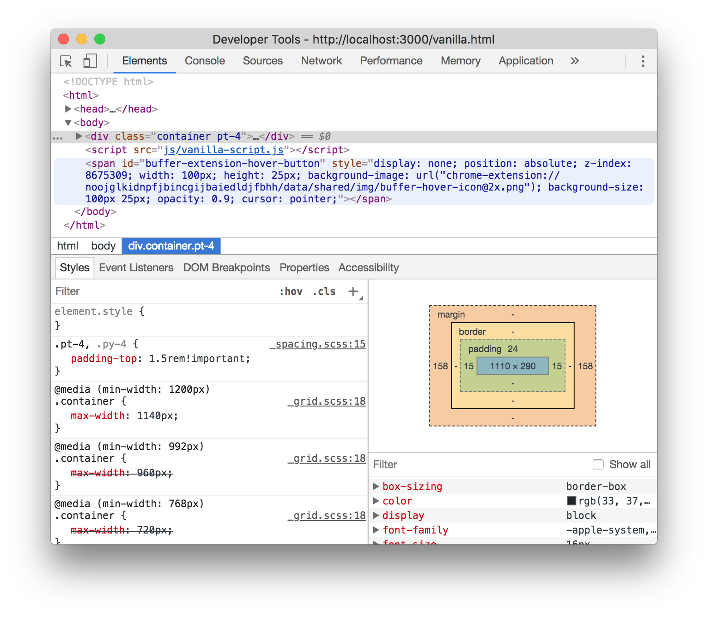
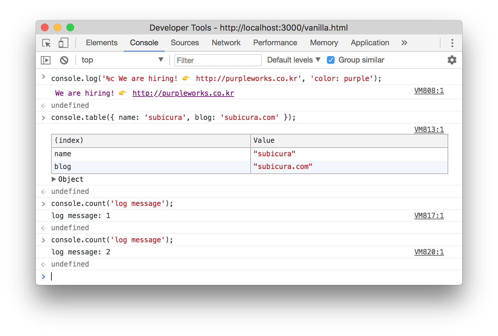
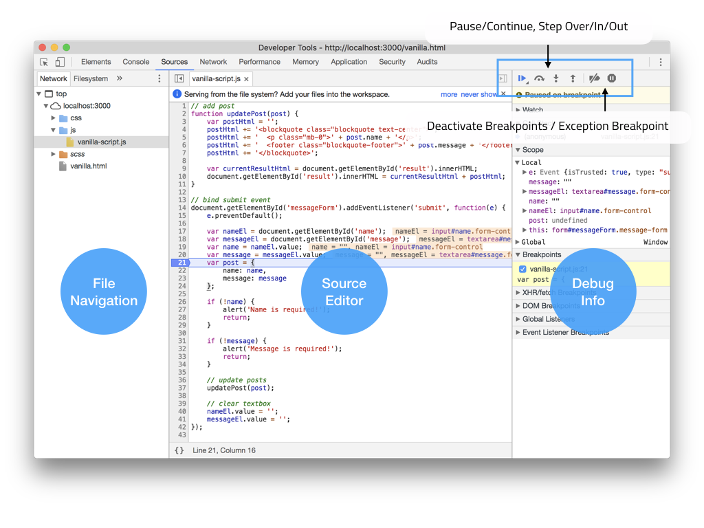
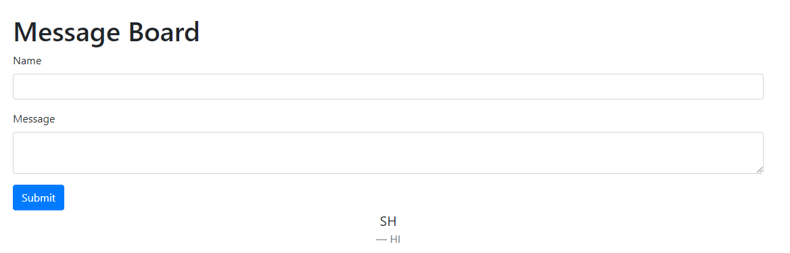
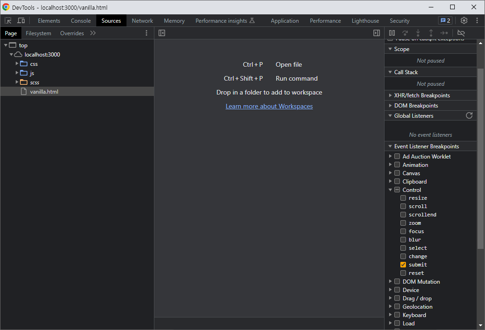

<h1>크롬 개발자 도구</h1>

## 주요 패널

### 1. Element

 

주로 디자인을 수정하는 용도로 사용

**DOM을 확인하고 CSS를 수정**할 수 있다

특정 DOM의 변화에 중단점을 걸 수 있는 기능이 있다

 

### 2. Console

 

로그를 확인하고 스크립트 명령어를 입력하는 패널

**중단점을 건 시점의 변수**를 확인할 수 있고 값을 평가하거나 수정할 수 있다

 

### 3. Sources

 

자바스크립트 디버깅의 가장 핵심적인 영역

왼쪽에 파일 관리창과 가운데 소스 에디터, 오른쪽에 디버깅 관련 정보창이 있다. (창의 크기에 따라 레이아웃이 바뀜)

토글 버튼을 누르면 세부 창을 열었다 닫았다 할 수 있다.

디버깅 정보창 위에 중단점 컨트롤을 이용하여 디버깅

 

<h2>디버깅하기</h2>

## Vanilla

### 1. 버그 찾기

Name, Message `Input`에 값을 입력한 뒤 `Submit`하면 위에 내용, 아래에 이름이 나와야한다.

 

반대로 나왔다.

 

## 2. 중단점 걸기

처음 보는 소스라서 아무것도 모른다고 가정

개발자 도구는 특정 라인이 아닌 글로벌한 이벤트에 대해 중단점을 만들 수 있는데 이름과 내용을 입력하고 폼 전송을 하는 순간을 체크하기 위해 `submit` 이벤트에 중단점을 생성할 수 있다.

> 오른쪽 디버깅 정보창에 `Event Listener Breakpoints.Control.submit` 체크되었음 !

그 후 다시 이름과 내용을 입력하고 `Submit`을 시도해본다